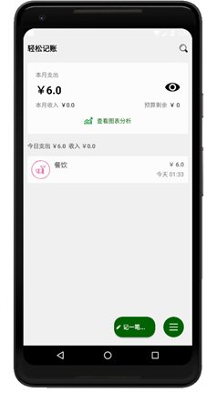
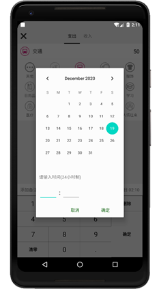
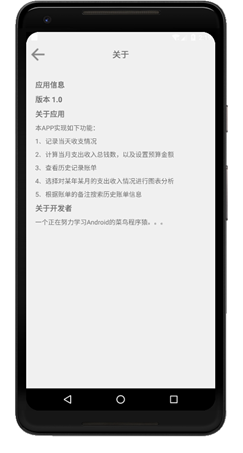
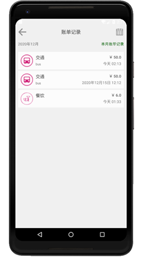
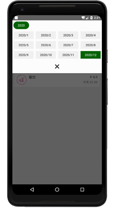
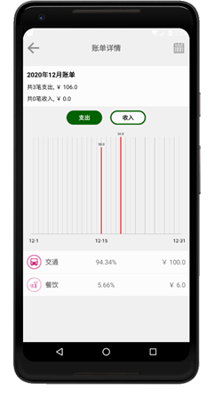
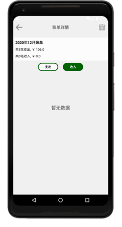

### 实验目的：综合掌握安卓的各部分内容

### 实验要求：运用安卓的四大组件，以及Intent等机制，完成安卓期末设计

### 实验内容：

APP的logo图标：

点击logo，启动程序，会先进入启动页，时间为3s，时间结束后会自动跳转到主界面。启动界面的下方有一句随机的格言，每次出现启动页，程序会从格言列表中随机取出一条格言，显示在界面上。

启动界面结束之后，会自动跳转到主界面：

点击下方的记一笔...，会跳转到记录支出收入的界面

这里采用的是Viewpaper控件，然后使用适配器嵌入两个fragment，使得支出和收入界面既可以通过点击上方的支出收入进行切换，也可以通过左右滑动进行切换。

支出和收入界面的软键盘是自定义的软键盘，而非系统的键盘

选择支出或收入的类型，输入金额，然后点击添加备注，会弹出备注对话框

输入信息，点击确定，就成功添加好备注了

然后再点击时间的文本，会弹出选择时间的对话框

选择对应的时间，点击确定，即可添加时间

点击自定义软键盘的确定按钮，就会生成一条账单信息存入数据表，并且如果账单的时间是今天，那么会添加到主界面的Listview中

长按账单信息的条目，会弹出询问是否删除的对话框，点击确定即可删除账单信息

点击主界面中的眼睛团案，可以隐藏或显示头布局的文本信息

点击预算剩余旁边的金钱文本，可以进行设置预算

由于设置预算的数据很单一，也十分简单，因此没有存放在数据库，直接使用SharedPreferences进行存放。设置完预算之后，头布局的文本数据会自动进行计算，然后进行相应的更改

点击右上角的搜索按钮，会转到搜索界面

输入搜索信息，会根据对账单的备注信息进行搜索，搜索的方式为模糊搜索，搜索完成会显示所有查找到的账单信息

点击主界面右下角的三条横杆的按钮，会弹出对话框

点击关于按钮，会跳转到关于界面，显示关于APP的相关信息

点击设置按钮，会跳转到设置界面，设置界面只有一种功能，就是清空数据库中的所有账单信息，当然，这里并不会清空对预算金额的设置信息

点击清空所有记录，会弹出询问是否删除的对话框，如果点击确定，则删除数据库中的全部账单信息，并且无法恢复

点击账单记录，会跳转到查询账单记录界面

长按条目，也会弹出询问是否删除的对话框，与主界面中的账单条目的删除一样，这里就不再多做介绍

点击右上角的日历Imageview，会弹出选择年份和月份的对话框，可以通过选择年份和月份查询对应的账单信息。这里值得注意的是，年份的出现是根据数据库中账单的年份进行设置的，例如：数据库中有2019年和2020年的账单，那么系统自动会添加两个年份，如果数据库中没有任何数据，那么就只添加今年的年份

点击主界面的查看图表分析按钮，或者是点击更多对话框中的账单详情按钮，会跳转到账单图表分析的界面

这里的支出和收入与之前记录账单的支出与收入页面同理，都是使用Viewpaper和fragment，既可以通过按钮点击切换，也可以左右滑动进行切换。当该月份有账单信息时，会进行图表显示，没有账单信息时，则直接显示暂无数据。图表的绘制通过引入MPAndroidChart进行实现。

点击右上角的日历Imageview，与之前的查找账单记录界面同理，可以选择对应的年份和月份。

### 实验总结：

#### 心得收获：通过上述实验，使我对一个安卓APP的建立的全过程有了更深刻的了解，这无疑将成为我日后进行安卓开发的重要项目经验。

#### 评价：

