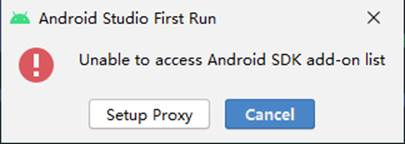
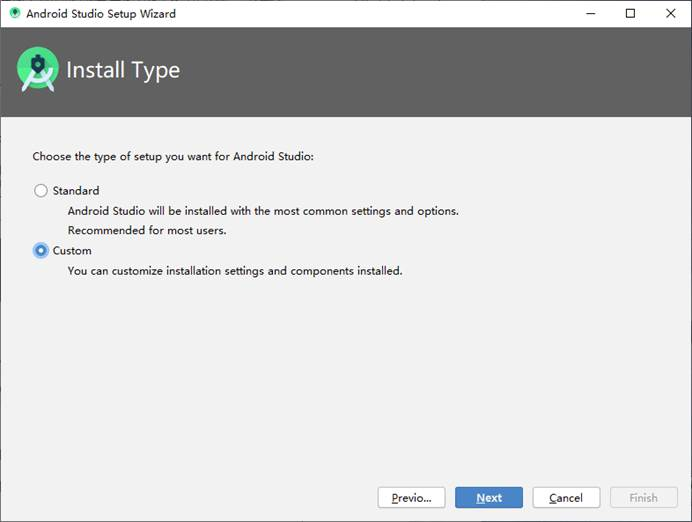
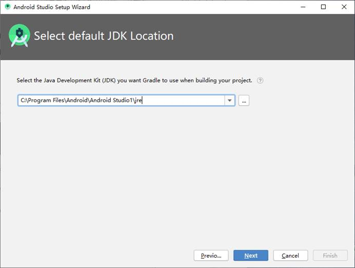
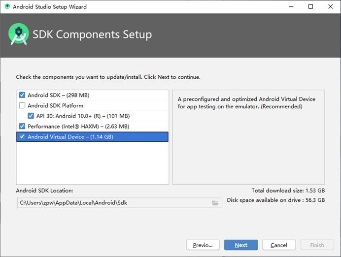
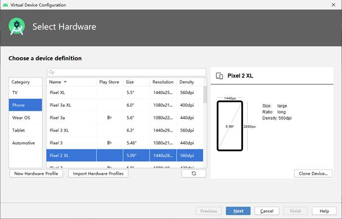

### 实验目的：配置安卓的开发环境，并配置与GitHub的连接

### 实验要求：完成工具链的安装并运行HELLOWORLD程序

### 实验内容：

一、安装Git

下载并安装Git

二、安装Sourcetree，并创建一个本地仓库

下载并安装Sourcetree，然后通过Sourcetree在本地创建一个仓库，用来存放安卓项目，并为与GitHub连接做好准备

三、注册GitHub账号，并且使用Sourcetree生成SSH密钥，连接到GitHub账号

1、注册好账号之后，点击GitHub个人头像，进入Setting，并选择SSH和GPG keys：

2、点击New SSH key：

3、在Title位置填写一个合适的名称，然后打开Sourcetree，点击工具，选择创建或导入SSH密钥：

4、点击Generate：

5、设置密码，然后点击Save private key，保存PPK文件：

 

 

6、复制公钥，并粘贴到GitHub中：

 

四、使用MarkDown

下载并安装Typora

五、安装Android Studio

C:\Users\zpw\AppData\Local\Android\Sdk

### 实验总结：

#### 心得收获：通过工具链的安装，成功配置了安卓的开发环境，并与GitHub进行了远程连接，使得通过Sourcetree可以将本地的安卓项目推送到GitHub仓库

#### 评价：

