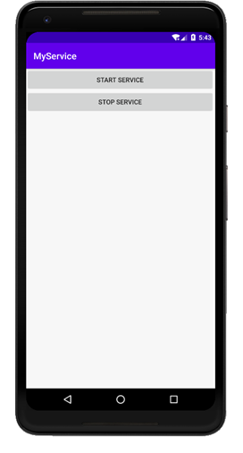
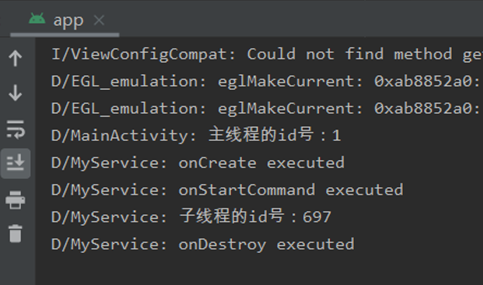

### 实验目的：掌握启动和停止服务

### 实验要求：启动和停止服务，服务代码运行在显示子线程

### 实验内容：

打开APP，显示主界面

界面中只有两个按钮，一个是start service（开始服务），另一个是stop service（停止服务）。

当点击start service按钮时，会构建一个Intent对象，并调用startService()方法来启动服务。同时会触发服务类中的onCreate()方法和onStartCommand()方法，在onStartCommand()方法中会创建一个子线程，并将服务需要运行的代码放在子线程中运行。在这里，值得注意的一点是onCreate()方法是在服务第一次创建的时候调用的，而onStartCommand()方法则在每次启动服务时都会调用，因此需要将子线程代码放在onStartCommand()方法中。

当点击stop service按钮时，同样是构建一个Intent对象，并调用stopService()方法来停止服务。同时会触发服务类中的onDestroy()方法停止子线程，并将服务销毁。

### 实验总结：

#### 心得收获：通过上述实验，使我对服务的启动和停止，以及其运作的机制有了初步的认识。服务十分适合去执行那些不需要和用户交互而且还要求长期运行的任务，使用服务能够让用户的手机打开多个应用程序时，每个应用程序依旧能够有条不紊的执行相应的功能。

#### 评价：

