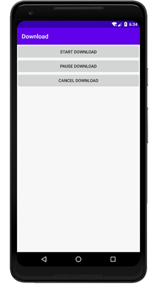
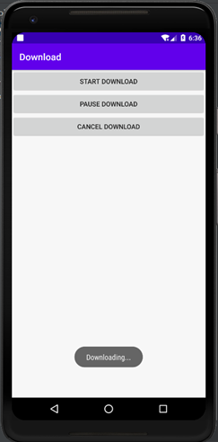
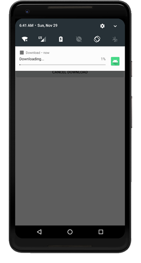
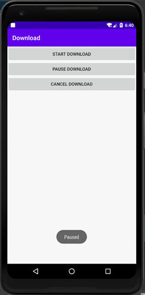
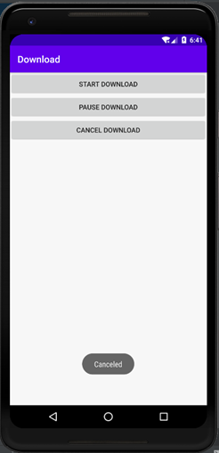
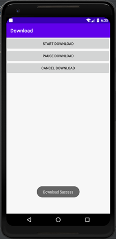
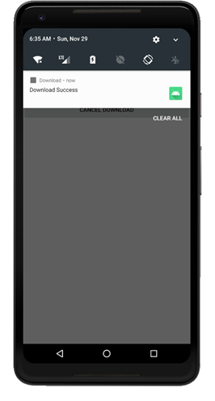
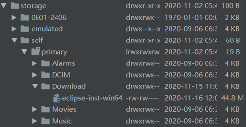

### 实验目的：掌握活动和服务之间的绑定

### 实验要求：使用活动绑定服务，在服务类中实现下载功能，并让下载的服务代码运行在异步任务的子线程中

### 实验内容：

运行APP，显示主界面

在主活动创建时，就会通过Intent的方式启动服务，并将主活动和服务进行绑定

主界面中有三个按钮：start download（开始下载），pause download（暂停下载），cancel download（取消下载）

点击start download按钮，主活动向绑定的服务传入需要下载的url链接，并且调用服务类的startDownload()方法，开始下载。而在服务类中的startDownload()方法中，会创建一个异步任务子线程，在子线程中开始执行下载的代码，同时还会向异步任务子线程传入DownloadListener类的实例，作为监听器，监听下载的情况，并且开启前台服务通知显示下载的进度

点击pause download按钮，主活动会调用服务类的pauseDownload()方法，暂停下载

点击cancel download按钮，主活动会调用服务类中的cancelDownload()方法，取消下载。而在服务类中的cancelDownload()方法中，会将已经下载的文件删除，并将前台服务通知关闭

当下载成功时，子线程在运行结束前会通过传入的DownloadListener类实例调用监听器类的onSuccess()方法，在界面上显示Download Success，通知下载成功

此时，就可以通过设备文件管理器查找到下载好的文件

### 实验总结：

#### 心得收获：通过上述实验，使我掌握了服务的绑定，并且使用活动去控制服务的运行。通过一整个实验，让我对服务的使用有了更深的了解，明白如何使用服务去完成一个具体的功能操作，并与活动紧密联系起来。

#### 评价：