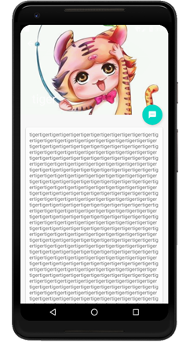

### 实验目的：掌握Material Design的相关控件的使用

### 实验要求：使用Material Design进行界面设计，使用的控件包括Toolbar，FloatingActionButton，Snackbar等，以及各种布局

### 实验内容：

运行APP，程序初始界面如下：

点击左上角的三个横线，弹出滑动菜单：

点击Friends，先返回主界面，再打开滑动菜单会发现Friends变量，其他的变暗，显示如下：

点击ToolBar右上角的三个按钮则会用Toast显示他被点击了，其中，setting有点不同，他隐藏在三个小点的里面，如下：

点击右下角的悬浮按钮，如下：

我们可以点击UNDO选项，这里模拟的是点击后删除数据，然后点击UNDO按钮就把数据重载进来的现象。

我们还可以下拉刷新，刷新前后图片会不同，对比如下：

接着，我们点击随便一个图片，进入内部如下：

这里，我们如果往下拉的话，图片还会智能的自己隐藏起来，如下：

点击左上角的回退按钮，则会返回上一级界面，如下：

### 实验总结：

#### 心得收获：通过上述实验，使我初步了解了Material Design，初步的掌握了Material Design内部的控件和布局。Material Design设计的界面十分精美，已经成为了行业的主流，日后进行安卓界面设计时，我会尽可能的使用Material Design。

#### 评价：