### 实验目的：掌握四种启动模式的机制和不同

### 实验要求：通过编程实践，了解四种启动模式各自的机制和他们的不同点

### 实验内容：

共设置了四个活动，同时给每个活动设置了不同的启动模式：

MainActivity的启动模式为：singleTask

SecondActivity的启动模式为：singleTop

ThirdActivity的启动模式为：singleInstance

FourthActivity的启动模式为：standard

接下来将一一测试不同启动模式下活动之间切换的差异。

standard模式：

standard是活动默认的启动模式，每次启动都会创建该活动的一个新的实例，不关心这个活动之前是否已经存在。

首先启动程序

然后连续点击三次BUTTON 4

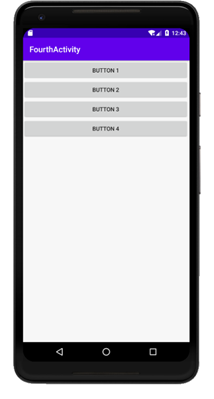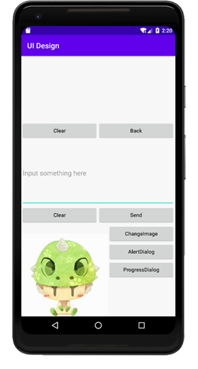

接下来，按回退键时我们可以发现有三个FouthActivity活动的实例

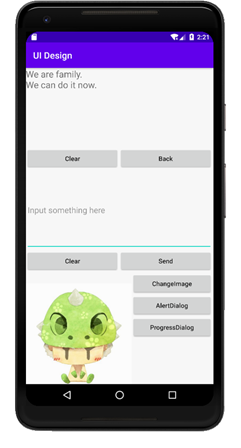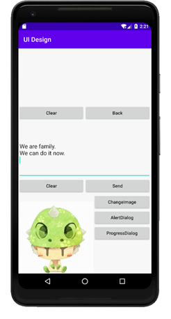

 

singleTop模式：

当活动的启动模式指定为singleTop，在启动活动时如果发现返回栈的栈顶已经是该活动，则认为可以直接使用它，不会再创建新的活动实例。如果发现返回栈的栈顶不是该活动，则会重新创建新的活动实例。

首先启动程序

接下来连续点击三次BUTTON 2

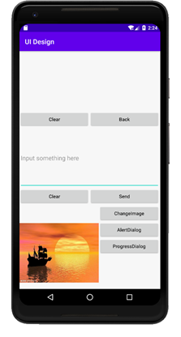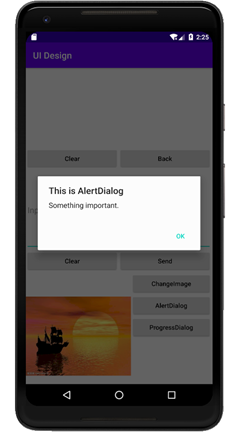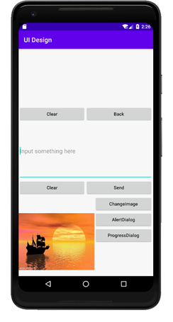

接下来，按回退键时我们可以发现只有一个SecondActivity活动的实例，并没有创建多个SecondActivity活动的实例，点击一下回退键就会立刻退回MainActivity。

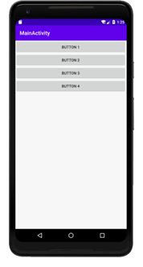

接下来我们尝试SecondActicity活动不在栈顶的情况

首先启动程序

接下来，按一下BUTTON 2，再按一下BUTTON 4，再按一下BUTTON 2

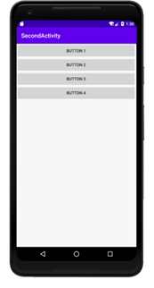

接下来，按回退键时我们可以发现，SecondActivity创建了两个实例，因为第二次点击BUTTON 2时，返回栈的栈顶是FouthActivity，所以会再次创建SecondActivity的实例。

singleTask模式：

当要启动singleTask模式的活动时，会先在返回栈中检查是否存在活动的实例，如果已经存在，则会将该活动之上的所有活动统统出栈，如果不存在，则会创建一个新的活动实例。

首先启动程序

然后点击一下BUTTON 4，再按一下BUTTON 1

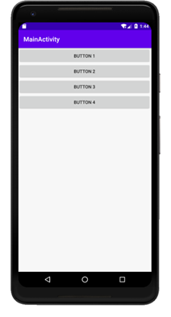

接下来，按回退键的时候会发现，只存在一个MainActivity活动实例，且因为MainActivity活动是主活动，所以按回退键会直接退回手机主界面，由此可以证明，调用已存在的singleTask模式活动时，会将该活动之上的活动全部出栈。

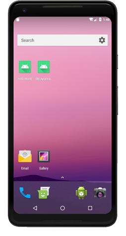

singleInstance模式：

singleInstance模式的活动会用一个单独的返回栈来管理。而且，退出时，会等管理程序的返回栈先完成退出后才会对管理singleInstance模式活动的返回栈进行退出

首先启动程序

接下来，点击一下BUTTON 3，再点击一下BUTTON 1

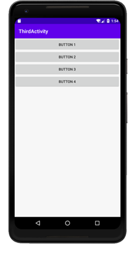

接下来，按回退键时会先从MainActivity退回ThirdActivity，然后在从ThirdActivity退回手机主界面

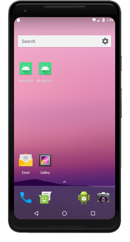

### 实验总结：

#### 心得收获：通过实践，我掌握了四种启动模式的机制以及不同点，日后进行开发的时候，可以针对特定的需求为每个活动指定不同的启动模式，可以使用户获得更好的APP体验。

#### 评价：

