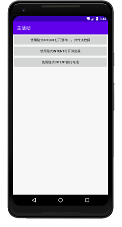
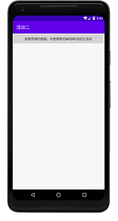
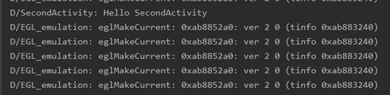
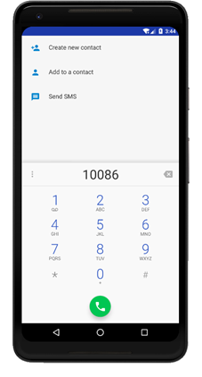

### 实验目的：掌握Intent的应用

### 实验要求：使用显示意图和隐式意图进行活动的切换和传递数据，以及使用隐式意图打开浏览器，进行拨号等

### 实验内容：

运行APP，显示主活动界面

点击“使用隐式INTENT打开活动二，并传递数据”按钮，会通过隐式意图的方法启动活动二，隐式意图需要在AndroidManifest文件中配置action和category，主活动通过指定活动二action的字符串，从而启动活动二，主活动在启动活动二时通过Intent向活动二发送了数据。

当按下活动二界面中的按钮时，活动二接收主活动传递过来的数据，并打印出来，活动二同时会通过显示意图的方式切换回主活动界面。

隐式意图除了切换活动，还有许多的用处，点击“使用隐式INTENT打开浏览器”，主活动调用Android系统内置的动作Intent.ACTION_VIEW打开浏览器，并由传入的Uri打开百度搜索页面。

点击“使用隐式INTENT拨打电话”，主活动会调用Android系统内置的动作Intent.ACTION_DIAL打开拨号界面，并且拨打指定的号码。

### 实验总结：

#### 心得收获：通过对上述例子的调试，使我对Intent有了初步的了解，特别是认识到隐式意图的强大功能，在日后的编程中，通过使用意图，可以实现更多方便完善的功能。

#### 评价：

