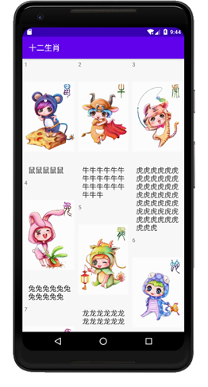
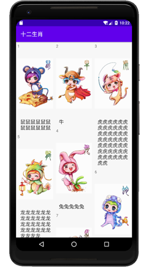
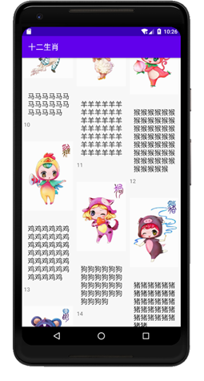

### 实验目的：了解并掌握RecyclerView的使用方式和缓冲机制

### 实验要求：使用RecyclerView，自定义一个瀑布流布局的界面，掌握RecyclerView的使用方式

### 实验内容：

首先，运行程序，展示已经设置好的瀑布流布局

界面仅由RecyclerView和多个item组成，每个item包含3个控件，分别是TextView、ImageView、EditText。这三个控件分别用于显示item的编号，item的图片，item的可编辑文本内容（默认设置为只读，双击后才可以进行编辑）。

程序为RecyclerView建立了一个适配器，把底层的数据通过封装送到适配器，然后由适配器合理的管理视图并展示数据。

程序为item的各个控件编写了相应的回调函数，包括对item整体的点击回调函数，对TextView的点击回调函数，对ImageView的点击回调函数，对EditText的点击回调函数。

接下来，开始测试为各个控件创建的回调函数

点击item中除控件以外的位置，可以触发对item整体的点击回调函数，点击后会出现一个短时间的toast，显示的文本为“你点击了xxx”，xxx为item的EditText文本，后面均为如此。

点击item的TextView控件，也就是左上角的编号，会出现一个短时间的toast，显示的文本为“你点击了xxx的编号”。

点击item的ImageView控件，也就是图片，会出现一个短时间的toast，显示的文本为“你点击了xxx的图片”。

单击item的EditText控件，也就是图片下方的文本，会出现一个短时间的toast，显示的文本为“你点击了xxx的名字”。

若双击item的EditText控件，两次点击的时间相隔不超过0.5s则视为双击，则可以编辑文本。

双击牛的文本，可以很明显看出在牛的文本上出现了光标，然后就可以对其进行编辑。编辑结束后，随机点击一处除此文本外的地方，该EditText就会恢复不可编辑的状态。

往下拖动，就会相继出现其它的item

### 实验总结：

#### 心得收获：通过本次实验，逐步掌握了RecyclerView的使用方式，并理解了RecyclerView的加载机制。除此之外，通过对回调函数的使用，使我对编写和使用回调函数有了更深的理解，通过重载控件的回调函数，可以完成许多细节上的把控。

#### 评价：