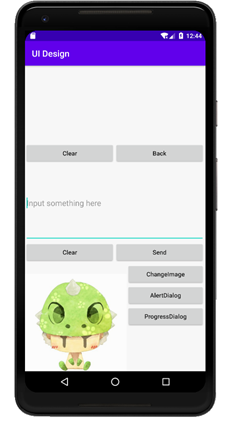
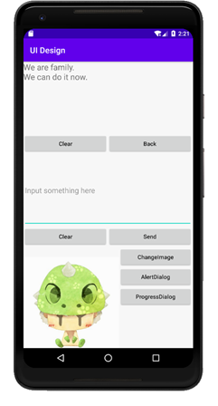
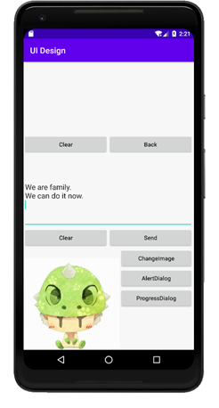
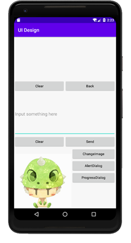
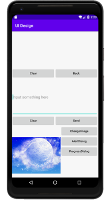
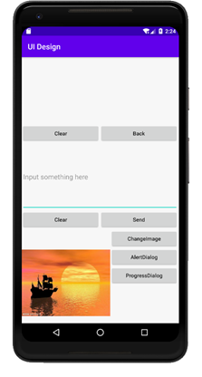
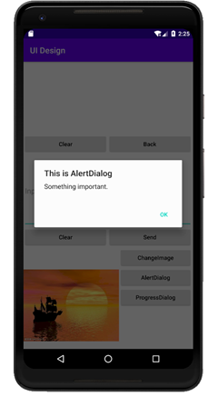
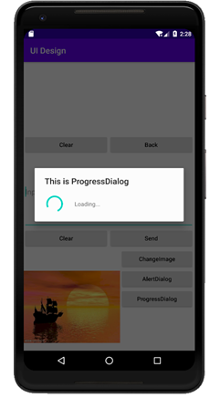

### 实验目的：掌握并深入了解安卓的UI设计

### 实验要求：自定义布局UI界面，了解布局间的嵌套关系，以及常用控件的使用方式

### 实验内容：

首先，运行APP，展示主界面

界面由垂直布局和水平布局嵌套形成，再逐步添加TextView、Button、EditText、ImageView等控件，并调整好位置

接下来，开始测试为各控件创建的回调函数

往EditText中输入一行文本

点击Send按钮，文本将被送到TextView

点击对应的Clear按钮可以清除对应的控件中的文本

点击Back按钮则可以将TextView中的所有文本退回给EditText

点击ChangeImage按钮可以切换ImageView控件中的图片，总共有三张图片

点击AlertDialog按钮会弹出一个AlertDialog对话框，点击OK对话框就会关闭

点击ProgressDialog按钮会弹出一个ProgressDialog对话框，ProgressDialog会在对话框中显示一个进度条，一般用于表示当前操作比较耗时

### 实验总结：

#### 心得收获：通过本次实验，逐步掌握了安卓中的布局和各种控件的使用，也进一步了解它们之间的机制，在设计APP时需要对界面进行美化，提升APP的体验感。

#### 评价：