### 实验目的：掌握并深入理解活动的生命周期

### 实验要求：展示生命周期的回调函数在不同条件下的触发条件和运行机制

### 实验内容：

以debug模式启动程序：

第一步先执行MainActivity的onCreate()函数，创建活动

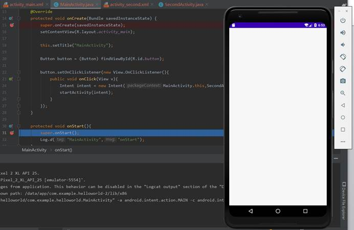

接下来执行MainActivity的onStart()函数

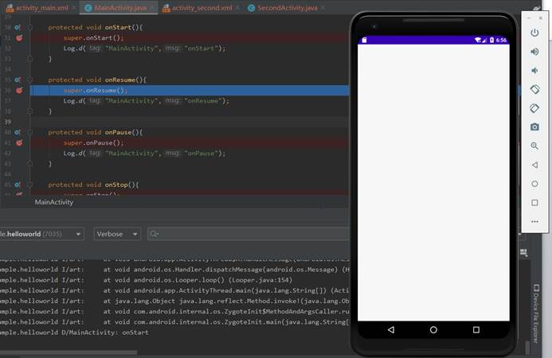

 

接下来执行MainActivity的onResume()函数

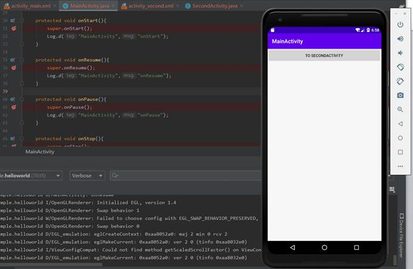

运行完onResume()函数之后，MainActivity活动就显示出来了。接下来通过按钮创建并进入SecondActivity活动。

按下按钮后，先调用MainActivity的onPause()函数，暂停第一个活动

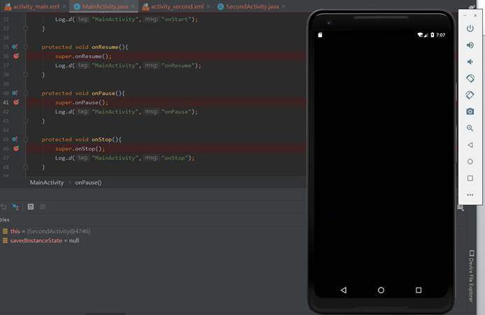

接下来执行SecondActivity的onCreate()函数，创建活动

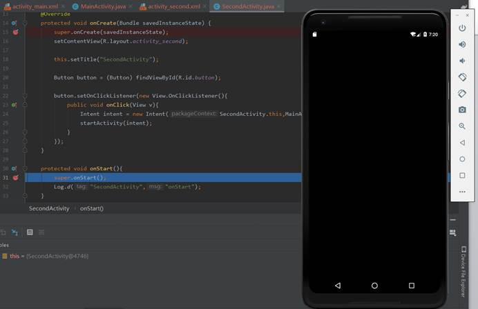

接下来执行SecondActivity的onStart()函数

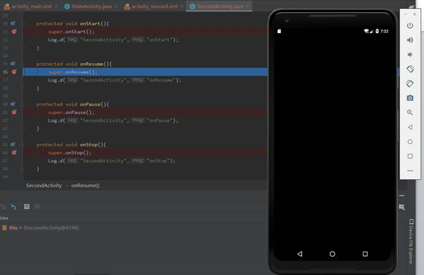

 

 

接下来执行SecondActivity的onResume()函数

运行完onResume()函数之后，SecondActivity活动就显示出来了。但是到这里还没有结束，还需要调用MainActivity的onStop()函数，使第一个活动完全暂停。

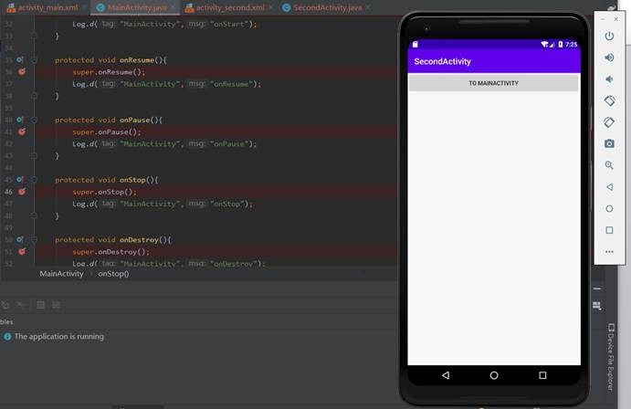

这里可以很明显的看到，通过点击按钮进入SecondActivity时，MainActivity只是停止，并没有直接销毁。接下来尝试通过回退键从SecondActivity回到MainActivity。按下回退键之后，首先执行SecondActivity的onPause()函数

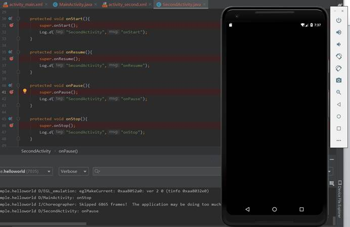

接下来执行MainActivity的onRestart()函数

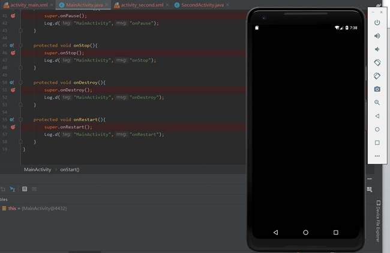

接下来执行MainActivity的onstart()函数

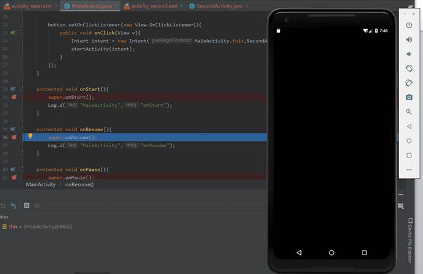

接下来执行MainActivity的onResume()函数

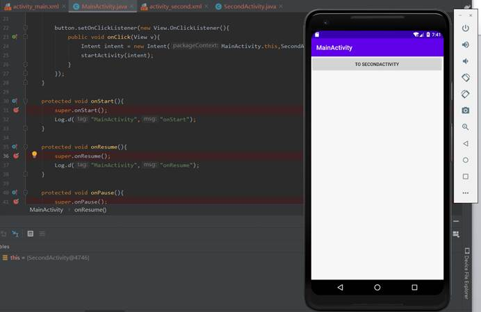

运行完onResume()函数之后，我们可以看到MainActivity活动已经从停止状态恢复到启动状态，并且显示出来了。但是到这里还没有结束，接下来会调用SecondActivity的onStop()函数

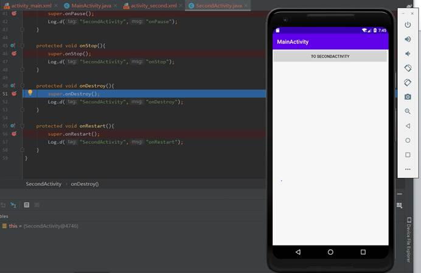

接下来还会调用SecondActivity的onDestroy()函数直接销毁之前创建的SecondActivity

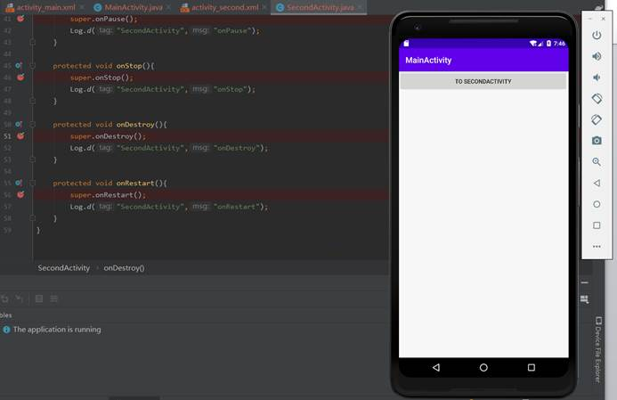

 

这里可以看出按钮和回退的明显区别，按钮只是将活动暂停，而回退会直接将当前活动销毁，回到上一个活动，如果没有上一个活动了，则会直接回到手机主界面

在MainActivity按下回退键，会执行onPause()，onStop()，onDestroy()，然后回到手机主界面

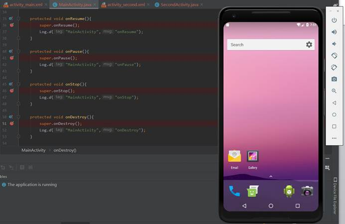

### 实验总结：

#### 心得收获：通过debug调试，使我对安卓活动的生命周期有了更深刻的理解。掌握活动的生命周期可以更好的管理应用资源，编写出更贴近用户使用的APP，给用户更好的使用体验。

#### 评价：

