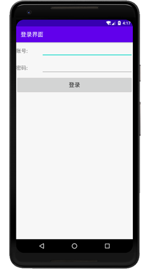
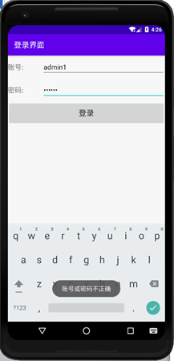
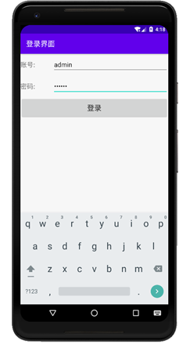
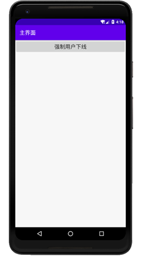
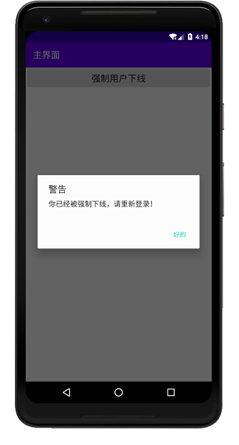
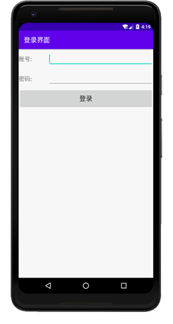

### 实验目的：了解广播的分类和机制，掌握如何注册广播接收器

### 实验要求：动态注册广播接收器，完成登录和强制下线等活动

### 实验内容：

运行APP，显示登录活动界面

输入账号和密码，点击登录，系统设置的账号为“admin”，密码为“123456”，如果输入的账号密码有误，则会弹出提示

如果输入账号密码无误，则会进入主界面

当点击主界面的按钮时，会触发按钮的点击事件发送一条广播，广播的值为com.example.broadcastbestpractice.FORCE_OFFLINE，这条广播用于通知程序强制用户下线，接收这条广播的广播接收器在程序运行时就已经动态注册完毕，广播接收器接收到发送的广播之后，弹出一个对话框，通知用户被强制下线，待用户点击确定后，跳转到登录界面。

当关闭程序时，系统会将动态注册的广播接收器取消注册。

### 实验总结：

#### 心得收获：通过对上述例子的编码与调试，使我充分明白广播的机制以及广播接收器的工作原理，通过使用Android的广播机制，可以使程序的业务逻辑变得更加灵活，也更加方便。

#### 评价：

