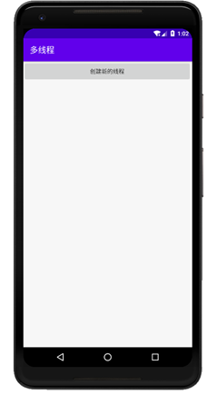
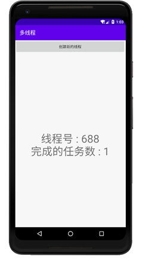
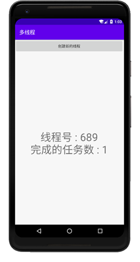
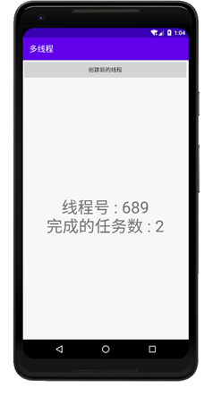

### 实验目的：掌握Android中的多线程机制

### 实验要求：创建子线程的程序框架，消息处理机制和多线程之间的数据交换

### 实验内容：

运行APP，显示主界面

每次点击创建新的线程按钮，会新建一个子线程，子线程进入死循环，每隔5秒完成任务数加1，并将信息送回主线程，然后主线程将子线程的线程号和当前完成的任务数显示出来

创建的子线程只有当APP被销毁时，才会结束

### 实验总结：

#### 心得收获：通过本次实验，使我掌握了创建子线程的方式，以及了解了多线程的运作机制，并掌握了线程之间数据交换的方法。

#### 评价：

