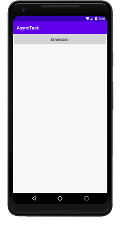
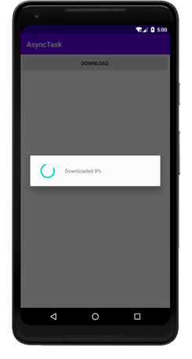
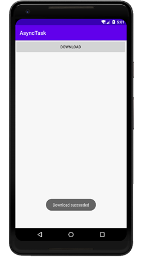

### 实验目的：掌握异步任务的隐含子线程程序框架

### 实验要求：使用AsyncTask程序框架实现多线程，以及多线程的消息处理机制和多线程之间的数据交换

### 实验内容：

运行APP，显示主界面

点击Download按钮，会创建一个DownloadTask的实例，然后在doInBackground()方法里去执行具体的下载任务，这个方法里的代码都是在子线程中运行的。因为这个方法是在子进程中运行的，因此无法对UI进行操作，因此在这个方法里会调用publishProgress()方法将当前的进度传进去，这样通过回调机制，onProgressUpdate()方法会被调用，执行相应的语句更新UI。这里值得提起的是，DownloadTask实例会自动创建子线程，并且除了doInBackground()方法是在子线程中运行的，其它的方法都是运行在主线程中的，因此需要放在子线程中运行的代码需要放在doInBackground()方法中。

当进度到达100时，子进程自动结束，DownloadTask实例通过回调机制调用onPostExecute()方法弹出下载成功的提示。

### 实验总结：

#### 心得收获：通过上述实验，使我明白了AsyncTask的异步消息处理机制，也初步掌握AsyncTask的使用方式。通过使用AsyncTask可以使多线程之间的消息处理和数据交换都变得十分简单。

#### 评价：